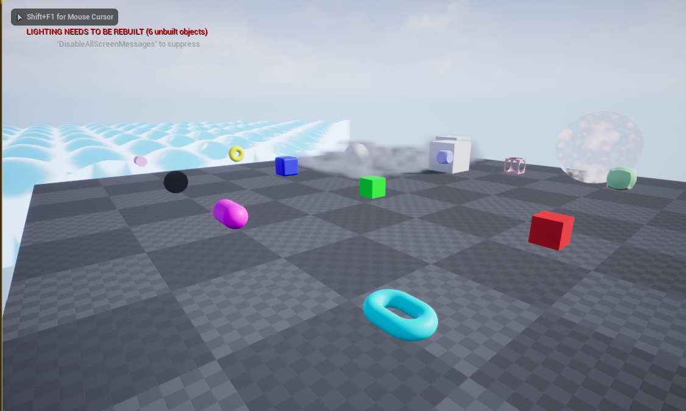
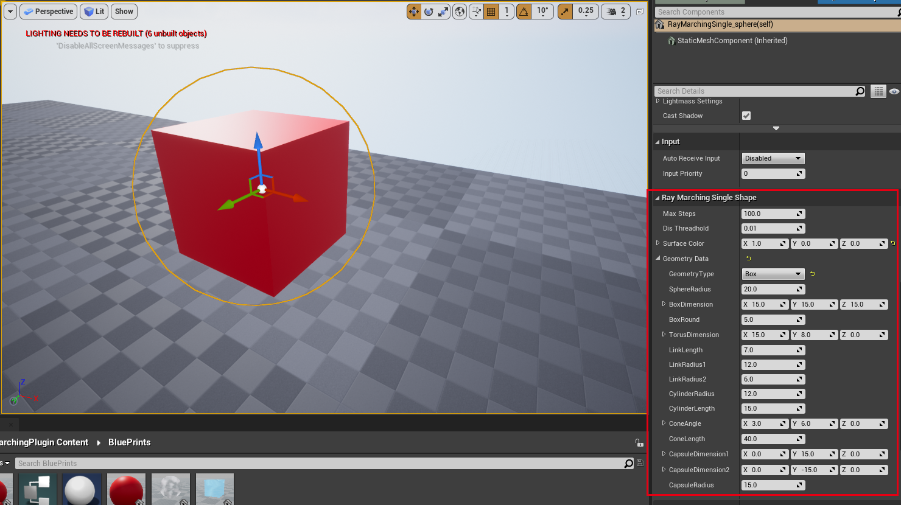
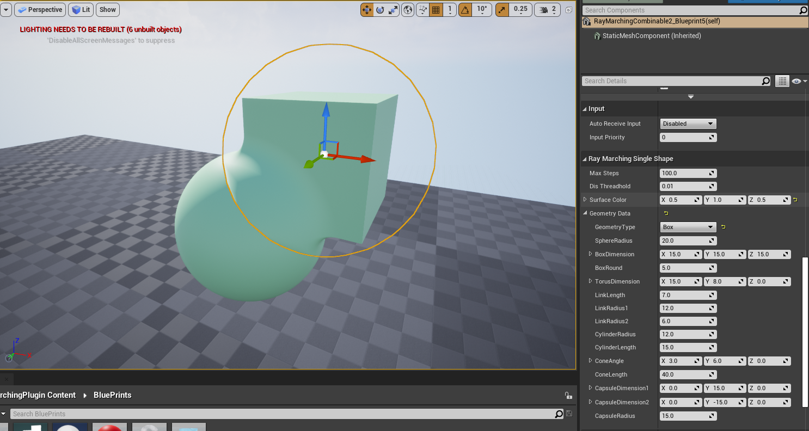
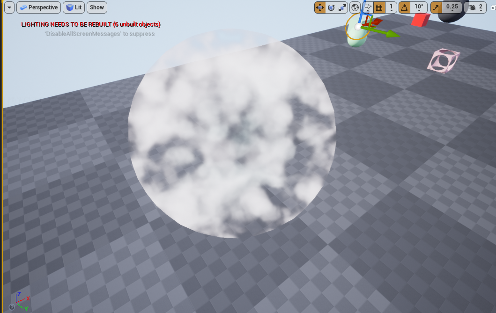
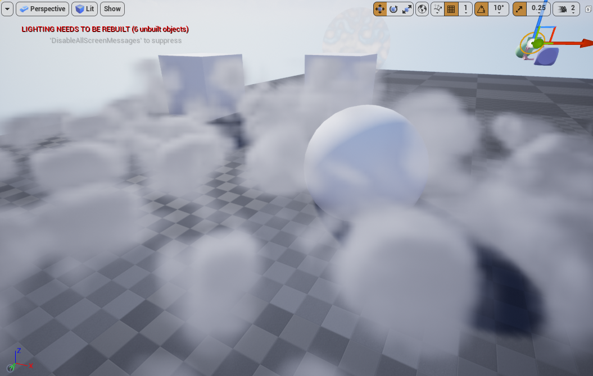
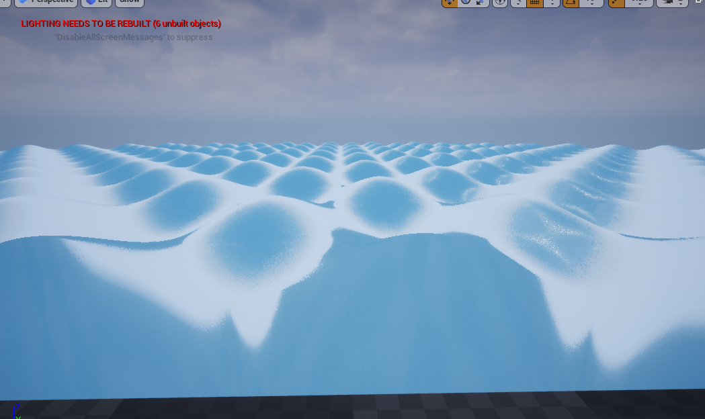
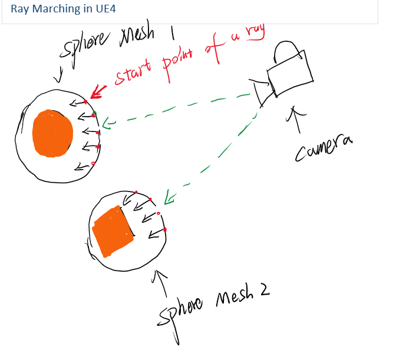
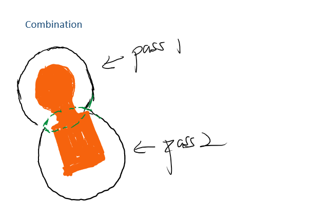

# UE4 raymarching Plugin Demo

This DEMO used raymarching to generate primitives, boolean operations between two ray-marched primitives and volume-texture-based cloud  in UE4.   
The main functions are encapsulated in plugin.    
This DEMO has been tested in UE4 4.25.0. and works in VR mode.   

URL of DEMO video: https://www.youtube.com/watch?v=WWwzQocgVwE&feature=youtu.be 

## Features
### 1.	raymarching primitives
1. Using UE4 material editor and custom node/shader to generate geometries with different shapes and normals for geometries.   
2. Enabling UE4 built-in lighting mode and make it work for rendering raymarching geometries.
3. As long as we know the SDF(signed distance function) for a shape, we are able to extend the shape that we allow user to create and generate right normals for the shape.
4. Exposing many parameters to blueprint and allowing users to adjust shape and geometric attributes at run time, such as radius for a shpere or dimension for a box.    
5. Providing auto scaling functionality. When the user adjusts the geometric attributes, the shpere mesh used to do the raymarching will be scaled accordingly to adapt to the size of the geometric shapes.

### 2.	raymarching boolean operations
1. Supporting three boolean operations between two raymarching geometry, allowing users to adjust shape and geometric attributes for each geometry engaged in the operation at run time.   
2. Supporting blending two geometry when doing boolean operation by using smooth parameter.

### 3.	Fog
1. Rraymarching cloud in a sphere area based on volume texture    
using raymarching method to generate cloud effect inside a shpere based on sampling 3D texture.

2. Rraymarching area fog based on UE volumetric plugin

### 4.	Basic raymarching terrian/wave
The demo shows the basic method of generating terrian and calculating normal for the terrian by using raymarching.
But because of the large scope that is usually required to cover when rendering terrain, using raymarching might bring performance hit to program.

## Implementation
### 1.	raymarching primitives
For the purpose of using UE4's built-in lighting system for geometries we generated by raymarching, I was not doing full-screen raymarching as the traditional method. Instead, I do raymarching in the local mesh. To be more specific, I am doing raymarching inside a shpere mesh for every single objects.
This is a little different from doing full-screen raymarching, the start point of the ray is not from the camera, but from surface of the sphere mesh.
Here is a illustration to explain.    

In the material blueprint, I using a custom node in which I calculate opacity and normals for this geometry.
The shader code for raymarching is inside the Shaders folder of plugin.

### 2. raymarching boolean operations
It is not hard to apply boolean operation, after we having sdf for geometries that are engaged in the operation. By using [formula from this article](https://iquilezles.org/www/articles/raymarchingdf/raymarchingdf.htm), we can easily implement boolean operations with full-screen raymarching. However, since we hope to allow user changing geometric atrributes for raymarching objects at run time, things become a little tricky.
Different from only using one render pass to draw the both geometry applying certain operation in full-screen raymarching, We use two pass to draw them seprately for our purpose.
Thus, this means that when two objects render with a separate render pass, they must have geometric information of each other to draw the intersection of two geometries. So, I designed a Blueprint to act as a medium to synchronize geometric information between two objects. Here is a illustration to explain.    
    
The green part in the illustration may be drawn in both passes, but thanks to z-test, the result of one pass will not be displayed. This is a trade off for flexibility.

### 3.	Fog
1. Using raymarching instead of sphere marching to achieve volume rendering, simpling data from a 3D texture to calculate the density of fog in each step, and then apply beer-Lambert Law to calculate the transparency of fog. Inspired by [Creating a Volumetric Ray Marcher](https://shaderbits.com/blog/creating-volumetric-ray-marcher) 
2. Taking advantage of volumetric plugin in UE4, Generating volumetric fog and implement AO and shadow for it.
Inspired by [Create nice and feasible volumetric cloud in Unreal Engine 4](http://asher.gg/?p=2600)

### 4.	Basice raymarching terrian/wave
Taking the inspiration from [raymarching terrains](https://iquilezles.org/www/articles/terrainmarching/terrainmarching.htm).

## Future works
1. Since the blueprint does not support passing arrays and structures to material as parameters, we do not achieve Boolean operation for multiple arbitrarily shaped object in this version. In the future, I will consider using custom global shader to introduce the support of structured buffer to improve this function.
2. The current way of rendering is to draw geometry in a sphere mesh. Although automatic scaling is added to make the sphere size as close as possible to the actual size of the drawn geometry, sphere is obviously not the best choice for a long narrow box. So, there is space for optimization. It may be a good choice to do raymarching in a mesh of some kind depending on the shape to be drawn. But it also means writing more specific code.

## References
[raymarching distance fields - 2008](https://iquilezles.org/www/articles/raymarchingdf/raymarchingdf.htm)    
[normals for an SDF - 2015](https://iquilezles.org/www/articles/normalsSDF/normalsSDF.htm)    
[Creating a Volumetric Ray Marcher](https://shaderbits.com/blog/creating-volumetric-ray-marcher)    
[Create nice and feasible volumetric cloud in Unreal Engine 4](http://asher.gg/?p=2600)    
[raymarching terrains](https://iquilezles.org/www/articles/terrainmarching/terrainmarching.htm).
